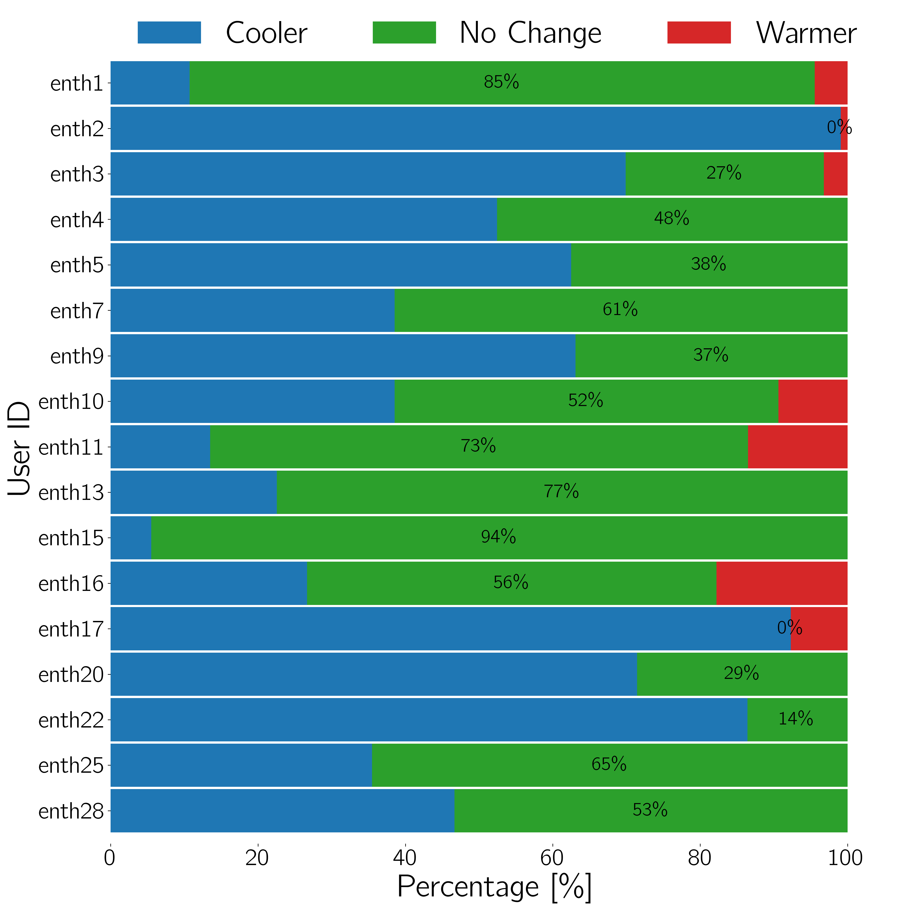
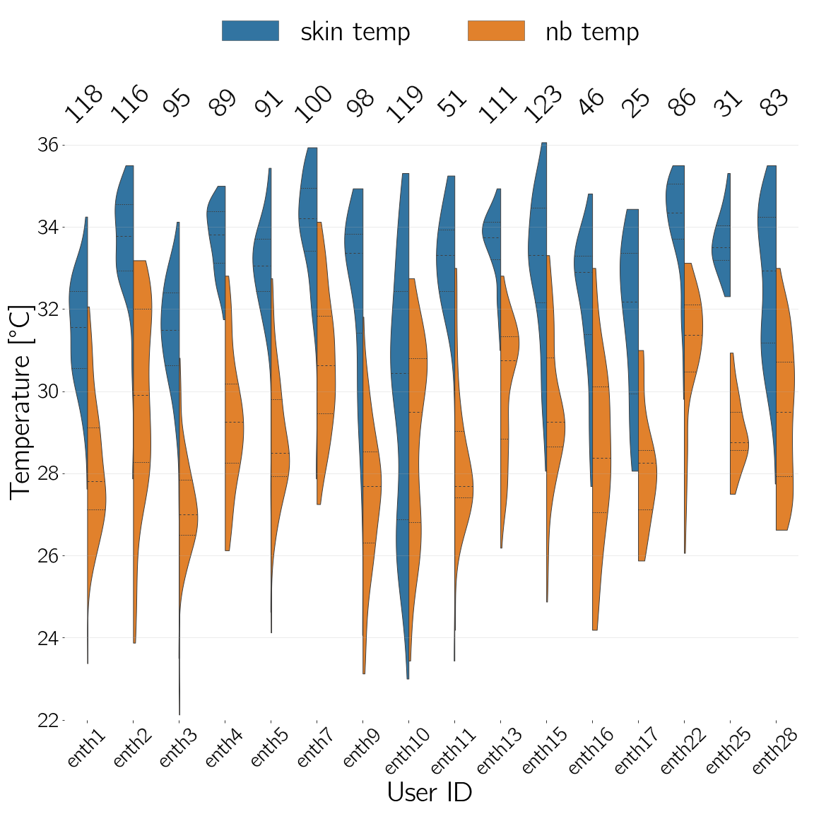
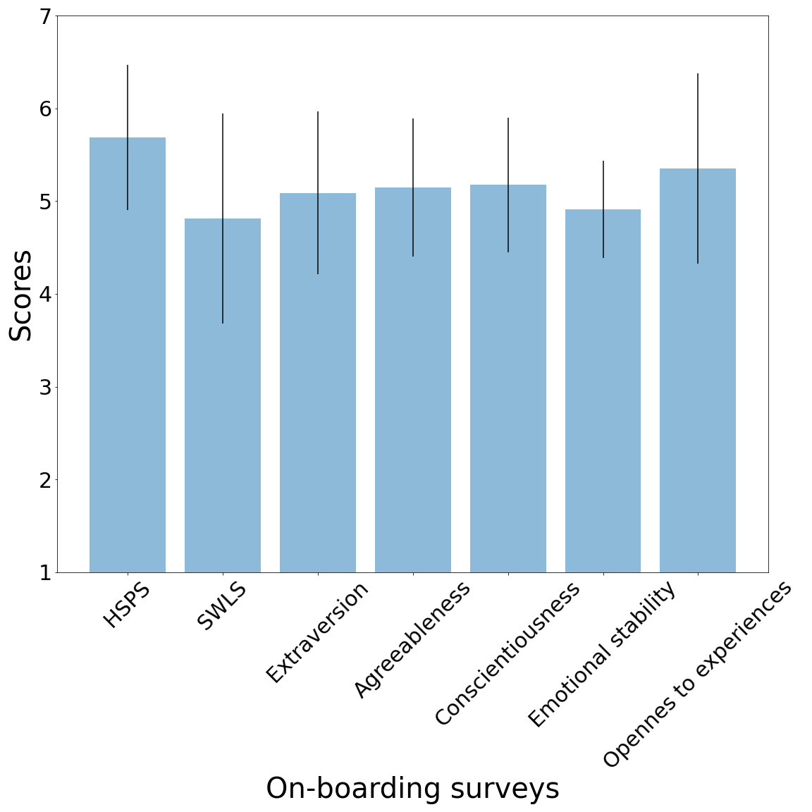

# Dataset: Longitudinal personal thermal comfort preference datain the wild

[](https://doi.org/10.5281/zenodo.5502441)
[](https://www.kaggle.com/claytonmiller/longitudinal-personal-thermal-comfort-preferences/code)


This repository contains the longitidinal experiment data named **ENTH**.

| # Participants (Sex) | Age range | # Responses/participant | Duration |
|----------------------|-----------|-------------------------|----------|
| 17 (10M, 7F) | 21 to 27 | 13 (min), 112(max) | 4 weeks |


## Requirements

To install requirements:

```setup
conda env create --file env/environment_macos.yaml
```

## Equipment

- Outdoor environmental sensors:
    - [PurpleAir-PA-II](https://www2.purpleair.com/collections/air-quality-sensors/products/purpleair-pa-ii) weather station
- Indoor environmental sensors:
    - [UbiBot WS1-Pro](https://testmeter.sg/products/UbiBot-WS1-Pro-WIFI-Temperature-Humidity-Light-Data-Logger-IoT-System/636)
    - [Awair Omni](https://www.getawair.com/business)
    - [senSING](https://sensing.online/)
    - Building Management Systems (BMS)
- Indoor localization:
    - [Steerpath](https://www.steerpath.com/) bluetooth beacons
    - [YAK mobile application](https://iopscience.iop.org/article/10.1088/1742-6596/1343/1/012145/meta)
- Wearables:
    - [Fitbit Versa 2](https://www.fitbit.com/global/us/products/smartwatches/versa) smartwatch
    - [Cozie](https://cozie.app/) smartwatch application
    - [iButtons](https://www.ibuttonlink.com/collections/ibuttons)


## Pre-processing

To reproduce the pre-processing done to the raw files, extracted directly from the different sensors, run the following files located in `data/raw/` in the following order:

1. Run `01_create_folders.py` to sort the files from `data/raw/` into different folders.
2. Run `02_sensors_data.ipynb` to process and format all sensor datasets into new files.
3. Run `03_main.ipynb` to process every user data with the sensor data (this will take quite long, around 20 minutes to an hour).
4. Run `04_temp_light_humidity.ipynb` to add columns for temp, light and humidity without being separated by the type of sensor.
7. There will be csv files created for each user, e.g. `enth01_merged_z.csv` and another file for all users `enth_all_users_merged.csv` and  `enth_new_cols_z.csv`. The final merged file `enth_tabular_merged.csv` has appropriate column naming conventions.
8. Run `05_surveys.py` to calculate the scores for each onboarding survey.

The resulting files are then saved in `data/processed/`

## Data

### On-boarding surveys

Three different surveys were completed by the study participants upon starting the longitudinal experiments:

- Highly Sensitive Person Scale [(reference)](https://pubmed.ncbi.nlm.nih.gov/9248053/)
- Satisfaction With Life Scale [(reference)](http://labs.psychology.illinois.edu/~ediener/Documents/Understanding%20SWLS%20Scores.pdf)
- Big Five Personality Trait (in the form of Ten-Item Personality Inventory survey) [(reference)](https://www.sciencedirect.com/science/article/abs/pii/S0092656603000461)

All three surveys have multiple questions each in a 7-level Likert scale and their score computation was done following their respective references.

The file with the calculated scores is `enth_surveys_calc.csv` and can be found in `data/processed/`.

| Feature name | Type | Description/Question |
|--------------|------|----------------------|
| `user_id` | String | Unique identifier for each participant |
| `yob` | Integer | Year of birth |
| `sex` | Categorical | Self-reported sex |
| `height` | Integer | Height in cm |
| `weight` | Float | Weight in kg |
| `shoulder_circumference` | Integer | Shoulder circumference, in cm |
| `years_here` | Integer | "How long have you been in Singapore (in years)?" |
| `used_weather` | Boolean | "Can you say that you are used to the weather in Singapore?" |
| `satisfaction_weather` | Categorical | 7-point Likert scale, "Can you say that you are satisfied with the weather in this city (outdoor weather conditions)?" |
| `sweating` | Categorical | From 1 to 5, "Do you suffer from sweating in Singapore?" |
| `enjoy_ourdoor` | Boolean | "Do you enjoy being outdoor in Singapore?" |
| `outdoor_hr_weekday` | Integer | "What is your estimation of your time (hours) spent outdoor (per day) during the weekdays? (for example 2 hrs)" |
| `outdoor_hr_weekend` | Integer | "What is your estimation of your time (hours) spent outdoor (per day) during the weekend? (for example 4 hrs)" |
| `hsps` | Float | Highly Sensitive Person Scale score |
| `swls` | Intenger | Satisfaction With Life Scale score |
| `extraversion` | Float | Extraversion trait score in a 7-point Likert scale |
| `agreeableness` | Float | Agreeableness trait score in a 7-point Likert scale |
| `conscientiousness` | Float | Consientiousness trait score in a 7-point Likert scale |
| `emotional_stability` | Float | Emotional Stability trait score in a 7-point Likert scale |
| `openness_to_experiences` | Float | Openness to New Experiences  trait score in a 7-point Likert scale |

### Environmnental and physiological measurements

| Feature name | Type | Description |
|--------------|------|-------------|
| `space_id` | Categorical | Unique location on campus |
| `building_name` | String | Campus building name |
| `air_vel` | Categorical | Perceived air movement, 9 = "Not Perceived", 11 = "Perceived" |
| `body_presence` | Boolean | Wheter the user was wearing the smartwatch or not |
| `change` | Categorical | Change location, activity or clothing, 11 = "Yes Change", 10 = "No Change" |
| `clothing` | Categorical | Clothing, 8 = "very light", 9 = "Light", 10 = "Medium", 11 = "Heavy" |
| `comfort` | Categorical | Overall comfort, 10 = "Comfy", 9 = "Not Comfy" |
| `heartrate` | Float | Heart rate in bpm |
| `indoor/outdoor` | Categorical | Location, 9 = "Outdoor", 11 = "Indoor" |
| `met` | Categorical | Metabolic rate, 8 = "resting", 9 = "sitting", 10 = "standing", 11 = "exercising" |
| `response_speed` | Float | Time in seconds it took to complete the survey |
| `resting_heartrate` | Float | Resting heart rate in bpm |
| `thermal` | Categorical | Thermal preference, 9 = "Warmer", 10 = "No Change", 11 = "Cooler" |
| `nb_temp` | Float | Near body temperature, at the wrist level, in degree Celsius |
| `skin_temp` | Float | Skin temperature, at the wrist level, in degree Celsius |
| `indoor_floor` | Integer | Building floor provided by the indoor bluetooth beacons |
| `indoor_latitude` | Float | Latitude provided by the indoor bluetooth beacons |
| `indoor_longitude` | Float | Longitude provided by the indoor bluetooth beacons |
| `co2_indoor` | Float | Indoor CO2 measurement by a fixed sensor in ppm |
| `voc_indoor` | Float | Indoor Volatile Organic Compound measurement by a fixed sensor in ppm |
| `pm25_indoor` | Float | Indoor Particulate Matter (PM2.5 - Fine Dust) measurement by a fixed sensor in µg/m3 |
| `noise_indoor` | Float | Indoor Ambient noise levels measurement by a fixed sensor in dB |
| `0.3um_count_outdoor` | Float | Outdoor count concentration (particles/100ml) of all particles greater than 0.3 µm diameter |
| `0.5um_count_outdoor` | Float | Outdoor count concentration (particles/100ml) of all particles greater than 0.5 µm diameter |
| `1.0um_count_outdoor` | Float | Outdoor count concentration (particles/100ml) of all particles greater than 1.0 µm diameter |
| `10.0um_count_outdoor` | Float | Outdoor count concentration (particles/100ml) of all particles greater than 10.0 µm diameter |
| `2.5um_count_outdoor` | Float | Outdoor count concentration (particles/100ml) of all particles greater than 2.5 µm diameter |
| `5.0um_count_outdoor` | Float | Outdoor count concentration (particles/100ml) of all particles greater than 5.0 µm diameter |
| `humidity_outdoor` | Float | Outdoor relative humidity by a weather station in % |
| `pm1.0_outdoor` | Float | Outdoor estimated mass concentration PM1(ug/m3) for PM1.0 |
| `pm10.0_outdoor` | Float | Outdoor estimated mass concentration PM1(ug/m3) for PM10.0 |
| `pm2.5_outdoor` | Float | Outdoor estimated mass concentration PM1(ug/m3) for PM2.5 |
| `pressure_outdoor` | Float | Outdoor pressure by a weather station in millibars |
| `temp_outdoor` | Float | Outdoor temperature by a weather station in degree Celsius |
| `user_id` | String | Unique identifier for each participant |
| `temp_indoor` | Float | Indoor temperature by a fixed sensor in degree Celsius |
| `light_indoor` | Float | Indoor light level by a fixed sensor in lux |
| `humidity_indoor` | Float | Indoor relative humidity by a fixed sensor in % |

### Visualization

#### Thermal preference responses distribution



#### Skin and near-body temperature distribution for participants



#### Surveys responses


